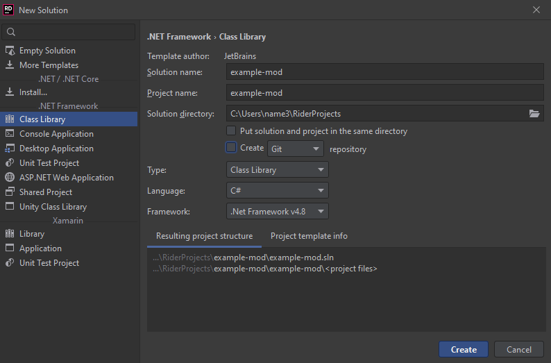
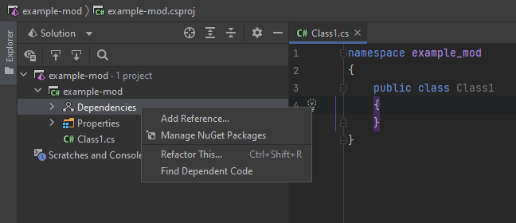
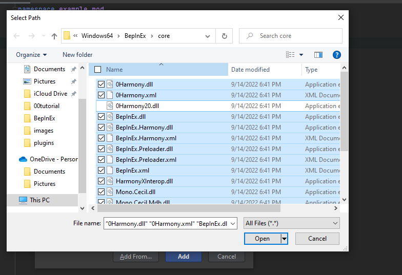
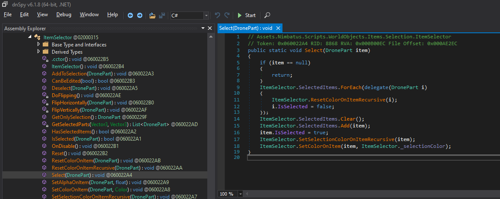

# How to make mods in nimbatus

### requirements

Dnspy: https://github.com/dnSpy/dnSpy/releases

Bepinex: https://github.com/BepInEx/BepInEx/releases

I'll be using rider but visual studio works fine and its the same process

with dnspy you can see the code of the game

open the file Assembly-Csharp.dll located in Nimbatus_data/Managed

that file contains all the code for the game

### step 1

create a new Class Library (.net framework) project



### step 2

once it is created right click Dependencies (called References in visual studio)



then select Add Reference

then in the menu select Add From (called Browse in visual studio)

after the file selector opens then navigate you your fame folder
from Bepinex/Core select everything except 0Harmony20.dll (ignore any errors you get)

from Nimbatus_Data/Managed select Assembly-CSharp.dll, Assembly-CSharp-firstpass.dll, UnityEngine.CoreModule.dll, and UnityEngine.dll

and select any others from the Managed folder you need



it may be helpful to move files you use to another folder so its easier to import for mods

### step 3

base harmony/bepinex code

```csharp
using BepInEx;
using HarmonyLib;

namespace example_mod
{
    [BepInProcess("Nimbatus.exe")]
    [BepInPlugin("uniquename.nimbatus.example-mod", "example-mod", "0.0.0.0")]
    public class example_mod : BaseUnityPlugin
    {

        public void Awake()
        {
            var harmony = new Harmony("uniquename.nimbatus.example-mod");
            harmony.PatchAll();
        }
    }
}
```

you just have to swap out the names to follow your own mod

this code just tells bepinex the mod info and tell harmony to patch in all modifications

the Patches class will contain all modifications to the code

### step 4

find the part of the code in dnspy you want to modify

for this tutorial I'll use Iteminspect.Select() and output info on selected parts into the console



first you create a class like this, you name the class whatever you want, I'll just name mine Select_Patch

```csharp
[HarmonyPatch(typeof(ItemSelector), "Select")]
public class Select_Patch
{


}
```

for the HarmonyPatch part you change ItemSelector and "Select" to whatever you are modifying

next we add in the modification, I want to display info on selected parts

```csharp
[HarmonyPatch(typeof(ItemSelector), "Select")]
public class Select_Patch
{
    public static void Prefix(DronePart item)
    {
        Console.WriteLine("name: " + item.Name);
    }
}
```

you must either name the function as Prefix or add [HarmonyPrefix] to it

now it is outputting the name of the selected part into the console (the console is writen to Bepinex/LogOutput.txt)

public fields are easy to get or set the value of.

for private, protected, or internal fields you have to use Traverse

```csharp
[HarmonyPatch(typeof(ItemSelector), "Select")]
public class Select_Patch
{
    public static void Prefix(DronePart item)
    {
        Console.WriteLine("name: " + item.Name);
        Console.WriteLine("positon: " + (Vector3)Traverse.Create(item).Field("_fixedPosition").GetValue());
    }
}
```

this gets the private field item.\_fixedPosition


Traverse will output everything as an object so you have to either cast as the correct type or do "as (your type)"

now the full mod is this

```csharp
using System;
using Assets.Nimbatus.Scripts.WorldObjects.Items.DroneParts;
using Assets.Nimbatus.Scripts.WorldObjects.Items.Selection;
using BepInEx;
using HarmonyLib;
using UnityEngine;

namespace example_mod
{
    [BepInProcess("Nimbatus.exe")]
    [BepInPlugin("uniquename.nimbatus.example-mod", "example-mod", "0.0.0.0")]
    public class example_mod : BaseUnityPlugin
    {

        public void Awake()
        {
            var harmony = new Harmony("uniquename.nimbatus.example-mod");
            harmony.PatchAll();
        }
    }

    [HarmonyPatch(typeof(ItemSelector), "Select")]
    public class Select_Patch
    {
        public static void Prefix(DronePart item)
        {
            Console.WriteLine("name: " + item.Name);
            Console.WriteLine("positon: " + (Vector3)Traverse.Create(item).Field("_fixedPosition").GetValue());
        }
    }
}
```

### extra

you can have the original function's code not run by making it a bool instead of a void and returning false, like this

```csharp
[HarmonyPatch(typeof(ItemSelector), "Select")]
public class Select_Patch
{
    public static bool Prefix(DronePart item)
    {
        Console.WriteLine("name: " + item.Name);
        Console.WriteLine("positon: " + (Vector3)Traverse.Create(item).Field("_fixedPosition").GetValue());
        return false;
    }
}
```

Traverse can modify values like this

```csharp
Traverse.Create(item).Field("_fixedPosition").SetValue(new Vector3(1, 1, 1)));
```

it can also run private methods

```csharp
Traverse.Create(item).Method("Method_Name").GetValue()
```

you can also have PostFixes which run after the original code has ran

```csharp
[HarmonyPatch(typeof(ItemSelector), "Select")]
public class Select_Patch
{
    [HarmonyPostfix]
    public static void PenisFix(DronePart item)
    {
        Console.WriteLine("name: " + item.Name);
        Console.WriteLine("positon: " + (Vector3)Traverse.Create(item).Field("_fixedPosition").GetValue());
    }
}
```

when you want to access something that in normal code would be accessed with "this" or "base" you would setup it with \_\_instance

```csharp
[HarmonyPatch(typeof(ItemSelector), "Select")]
public class Select_Patch
{
    [HarmonyPostfix]
    public static void PenisFix(DronePart item, ItemSelector __instance)
    {
       Console.WriteLine(__instance.SelectionColor)
    }
}
```

here instead of

```csharp
this.SelectionColor
```

we use

```csharp
__instance.SelectionColor
```

Harmony docs: has more info on what you can do with harmony

https://harmony.pardeike.net/articles/intro.html
